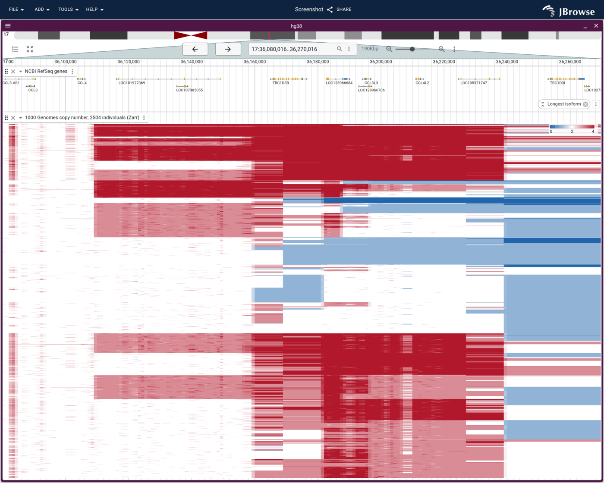

# jbrowse-plugin-zarr

Reads multi-sample quantitative signal from a [Zarr v3](https://zarr.dev/) store
into a JBrowse 2
[`MultiQuantitativeTrack`](https://jbrowse.org/jb2/docs/user_guides/multiquantitative_track).
The store holds one samples-by-bins array per resolution level, described by the
[`jbrowse_signal_matrix`](#store-format) metadata below, so this reads stores
written for it rather than Zarr in general.



Every individual in the 1000 Genomes panel over the CCL3L1 locus, one row each,
clustered so the copy-number classes separate. White is two copies, red a gain,
blue a loss. The whole screen is three requests against one store. Built in
[Population copy number with the 1000 Genomes panel](https://jbrowse.org/jb2-staging/docs/tutorials/population_cnv/),
this adapter's worked example, which also covers writing the store.

The copy-number values are not ours. They are
[QuicK-mer2](https://github.com/KiddLab/QuicK-mer2) estimates over the 30x 1000
Genomes panel, produced by the Kidd lab at the University of Michigan and
published as the [KiddLab/kmer_1KG](https://github.com/KiddLab/kmer_1KG) track
hub. If you use them, cite Shen F and Kidd JM,
[Rapid, Paralog-Sensitive CNV Analysis of 2457 Human Genomes Using QuicK-mer2](https://doi.org/10.3390/genes11020141),
Genes 2020, 11(2):141.

## Why

A multi-sample signal track built from one BigWig per sample is bound by round
trips, not bytes. Each file needs its header, chrom B-tree and R-tree index
before it knows where a region's values live, so a screen costs three to four
sequential requests per sample however small the values are. At 2500 samples
that is thousands of requests for a few kilobytes of data.

A samples-by-bins array chunked `[all samples, N bins]` answers the same screen
in one or two chunk reads, whatever the sample count, straight off static
hosting with no tile server.

## Install

In **beta**: not on npm and not in the
[plugin store](https://jbrowse.org/jb2/docs/user_guides/plugin_store) yet, but
the built bundle is hosted, so it loads from any config today (see
[configuring plugins](https://jbrowse.org/jb2/docs/config_guides/plugins)). Add
the plugin and a track:

```json
{
  "plugins": [
    {
      "name": "Zarr",
      "url": "https://jbrowse.org/demos/zarr/jbrowse-plugin-zarr.umd.production.min.js"
    }
  ],
  "tracks": [
    {
      "type": "MultiQuantitativeTrack",
      "trackId": "cohort_signal",
      "name": "Cohort signal",
      "assemblyNames": ["hg38"],
      "adapter": {
        "type": "MultiWiggleZarrAdapter",
        "uri": "https://example.com/cohort.zarr"
      },
      "displayDefaults": { "defaultRendering": "multirowdensity" }
    }
  ]
}
```

The adapter config is the store's location and nothing else. Sample names, bin
size and resolution levels come from the store's own metadata.

## Store format

A Zarr v3 group whose root attributes carry a `jbrowse_signal_matrix` object,
plus one `float32` array per resolution level:

```json
{
  "jbrowse_signal_matrix": {
    "version": 1,
    "samples": [{ "name": "HG00551", "group": "PUR" }],
    "levels": [
      {
        "path": "bin1000",
        "binSize": 1000,
        "refs": {
          "chr17": { "start": 35000000, "binOffset": 0, "numBins": 2500 }
        }
      }
    ]
  }
}
```

Each level array is shaped `[samples, bins]`, C order, with every refName laid
end to end on the bin axis at its own `binOffset`. `start` is the genomic
coordinate of that refName's first bin, so a store can cover one window of one
chromosome rather than a whole genome. Unmeasured bins are the array's `NaN`
fill value and are dropped rather than drawn as zero.

Levels are a resolution pyramid: the adapter reads the coarsest level whose bins
are still no wider than a screen pixel.

Write one with
[`build_signal_zarr.ts`](https://github.com/GMOD/jbrowse-components/blob/main/scripts/build_signal_zarr.ts),
which packs a list of BigWigs into this layout.

## Codecs

This build ships zarrita's own codecs (`bytes`, `gzip`, `zlib`, `transpose`,
`crc32c`) and stubs the numcodecs ones (`blosc`, `lz4`, `zstd`), which are
1.35 MB of wasm against a 52 KB plugin. A store compressed with one of those
fails with a message naming the codec rather than silently misreading. Write
stores with gzip.

## Develop

```bash
pnpm install
pnpm test          # vitest, adapter round trip against an in-memory store
pnpm start         # esbuild watch, serves dist/out.js on :9000
pnpm build         # dist/jbrowse-plugin-zarr.umd.production.min.js
```

Point a JBrowse config's plugin `url` at `http://localhost:9000/dist/out.js` to
develop against the watch build.

## Publish

```bash
pnpm betabuild     # lint, typecheck, test, build, upload, invalidate, verify
```

Pushes to `s3://jbrowse.org/demos/zarr/`, which is what the config URL above
serves. The script re-downloads the entry point through CloudFront afterwards
and fails if it does not match what was just built. jbrowse.org is behind a
CDN, and an upload the edge keeps shadowing looks exactly like a successful
publish otherwise.
